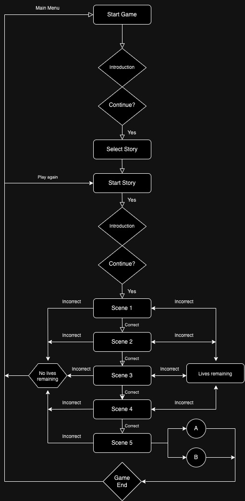

# Adventure Line
Adventure Line is an interacive program that has been inspired by the Choose Your Own Adventure series to encourage children reading by placing them them in the role of the main character and giving the player the power to influence the line of story and the outcome based on their decisions as the game requires the user's input to progress through a story. This objective fits really well with this type of game as it's an interactive text based program.

The target audience for Adventure Line would be young children - teens due to type of stories that would be available to play and the type of game that is likley to engage this age group. This audience will fit the demographic to target for the objective of using an interacive text based app to get them interested in reading.

[Visit app here](https://adventure-line-e6e050da4a13.herokuapp.com/)

 - needed?

# Logic Map

## How to play

This is a text based app game on a console that requires user input on prompts from the game to progress through the story to the ending.

The player has three lives, if a user makes the incorrect decision they get an opporunity select a different answer on the same scene but if they select 3 incorrect decisions throughout the game, the game is over and the user user is given the option of either going back to the main menu or playing the same story again.

There are points to be gained throughout the gameplay, players gain points on correct decision and loses points on incorrect decisions - players should aim to get the highest score by the end of the story.

Decision from players are made at the end of scenes where options are provided to the player on what they need want to do next where things will happen - either the user selects the correct decision and progresses to the next scene or if the user chooses the incorrect decision they lose a life, the continues until the ending is reached.

# Features

## Dependencies - random

## Future to implement

# Testing

# Bugs/Fixes

# Validator Testing
## Pep8

# Deployment

