# Adventure Line
Adventure Line is an interacive program that has been inspired by the Choose Your Own Adventure series to encourage children reading by placing them them in the role of the main character and giving the player the power to influence the line of story and the outcome based on their decisions as the game requires the user's input to progress through a story. This objective fits really well with this type of game as it's an interactive text based program.

The target audience for Adventure Line would be young children to teens due to type of stories that would be available to play and the type of game that is likley to engage this age group. This audience will fit the demographic that would be interested in a game like this where the objective of using an interacive text based app to get them interested in reading stories.

[Visit app here](https://adventure-line-e6e050da4a13.herokuapp.com/)

 - ADD SCREENSHOT HERE!!!!!

### What the user wants
The user would want to be entertained by the game, they would want a good experience being able to make choices within a story, they would would also want a slight challenge and not an easy walkthrough. 

### What the developer wants
The developer would want users to have the experience of being the main character in a story and provide them with a varierty of decisions they need to make. The developer would want user to re-play the game as much as possible and as much positive experience to get players interested in fictional stories.

## How to play

This is a text based app game on a console that requires user input on prompts from the game to progress through the story to the ending.

The player has three lives, if a user makes the incorrect decision they get an opporunity select a different answer on the same scene but if they select 3 incorrect decisions throughout the game, the game is over and the user user is given the option of either going back to the main menu or playing the same story again.

There are points to be gained throughout the gameplay, players gain points on correct decision and loses points on incorrect decisions - players should aim to get the highest score by the end of the story.

Decision from players are made at the end of scenes where options are provided to the player on what they need want to do next where things will happen - either the user selects the correct decision and progresses to the next scene or if the user chooses the incorrect decision they lose a life, the continues until the ending is reached.

# Development

The idea was to get the Choose Your Adventure theme into a text based game format. The main thing we needed was the stories and to build everything around decision element. To make the game fun, add a little bit of challenge and re-playability the elements of points and lives were added to keep the game interesting.

I had first written a story, and cut the story into introduction, scenes and an ending - the scenes are where the different decisions had to be created for the user to select to go through the story.

## Logic Map

The logic map shows how the game functions following user inputs and how the game is affected by incorrect decisions and 0 lives.

## Surface
As this is a text based game, it does not really have a front-end and the game is played on a console.

# Features

## Random Variables
This feature has been added as bit to make the game more fun for users whenever they play when the names of the Princess, King, the dragon and the kingdom changes each time the game is played. It adds a bit of dynamism to the story to have different characters appear each time they play
In future it would be great to add when different characters appear they would bring a class of their own characteristics that affect the narrative of the story.

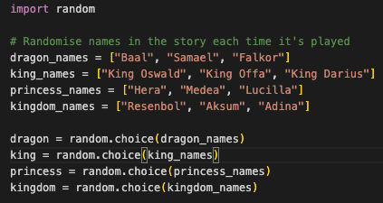

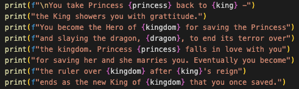

## Invalid Key
In every function else statements have been included to ensure users are inputting the correct keys within the game by notifying them an incorrect key has been input and provide them the key/s they need to input to continue.

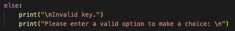

## Start Game
This is essentially the game's main menu - it introduces the player to the game, explaining what the game is about and how it is played.
It prompts the user to start the game to continue to the Select Story section.

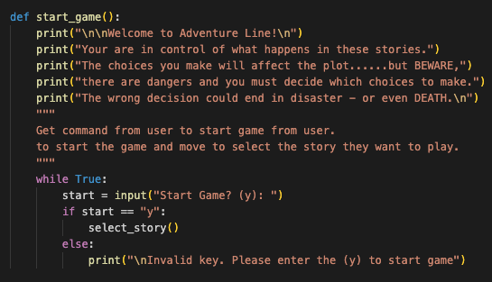

## Select Story
The Select Story function is where a player would have options of the stories available to play, at the moment there is only one story available but there would be a selection a choose from here.

The function prompts the user to press a number to select a story.

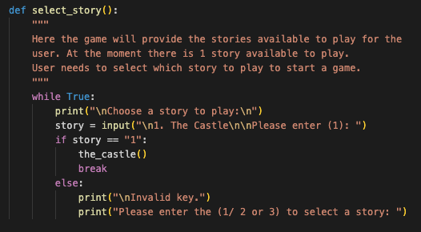

## Game Over
This function will only appear in the game when a play runs out of lives during gameplay, it will give the player the option to either play the story again from the beginning or back to the main menu.

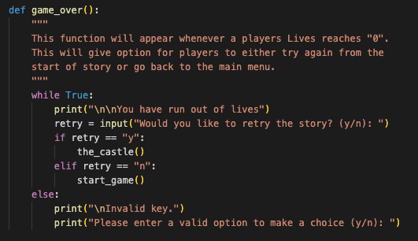

## Game End
At the end of the game, the game_end function will appear that congratualtes the player for reaching the ending and to provide the option to either play through the story again or go back to the main menu.

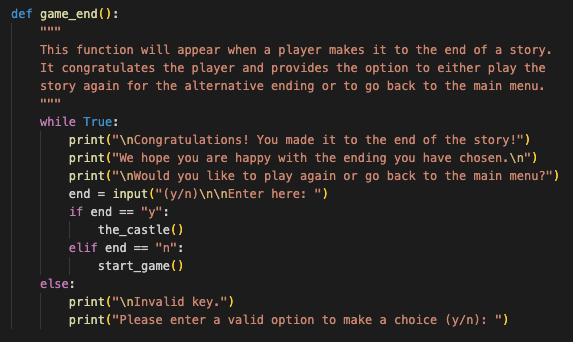

## The Castle
Once the player selects the story the_castle function will start. The function begins providing the setting of the story to the user and introducing the characters involved. 

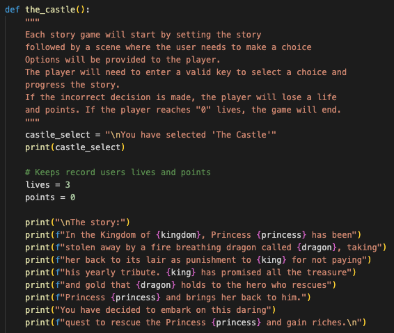

### Lives & Points
It this section explains to the users how lives and points work in the game, why they are important and how it affects the player.

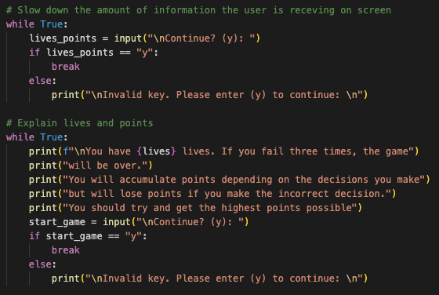

### Scenes
Stories will be cut up into scenes during game-play after the story is introduced to players. At the end of each scene players will be provided with options for them to take which could lead either lead them to the next scene, death or failure.

Depending on the players choice they could lose a life, points or not gain as much points from the other options.

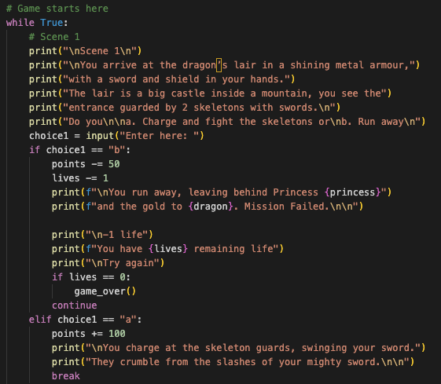

The last scene will provide the player with an ending to the story and the game_end function will appear for the player to be able to navigate back to the main menu or play the story again.

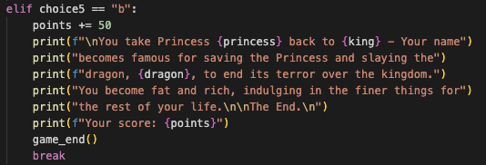

## Features to implement

### Add colour
Since it's a text based game, the readability could be made better if colour is added on the text to help the reader seperate the type of information being provided and bring attention where the game would want them.

### More stories
More stories definitely needs to be added to provide players with a variety which can easily be done as it will follow a similar formula to The Castle but have its own story-line and decisions a player needs to make.

### More variables that affect story-line and outcome
A vast amount of variables can be added to the story and future stories that affect the story-line and outcome. This will make the game more enjoyable and encourage re-playability.

# Testing - screenshots

# Bugs/Fixes

# Validator Testing
## Pep8

# Technologies Used

# Deployment

# Credit